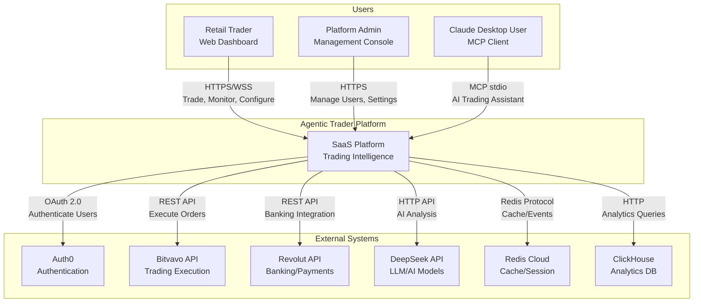

# C4 Architecture - Level 1: System Context

> System Context diagram showing Agentic Trader Platform interactions with users and external systems

---

## Overview

The Agentic Trader Platform is an AI-powered trading system that provides real-time market analysis, automated trading strategies, and portfolio management through a SaaS model.

---

## Context Diagram



---

## Personas

### Retail Trader
- **Goal**: Execute trades based on AI recommendations
- **Interactions**: Web dashboard, real-time price updates, portfolio tracking
- **Frequency**: Daily active use during market hours

### Platform Admin
- **Goal**: Manage platform users, monitor system health, configure settings
- **Interactions**: Admin panel, analytics dashboards, user management
- **Frequency**: Weekly/Bi-weekly administrative tasks

### Claude Desktop User
- **Goal**: Use AI assistant for trading analysis via natural language
- **Interactions**: Claude Desktop with MCP tools, chat-based trading commands
- **Frequency**: Ad-hoc analysis and research

---

## External Systems

| System | Purpose | Integration Type | Protocol |
|--------|---------|------------------|----------|
| Auth0 | User authentication & authorization | OAuth 2.0 / OIDC | HTTPS/REST |
| Bitvavo | Cryptocurrency trading execution | Exchange API | HTTPS/REST |
| Revolut | Banking, fiat transactions | Open Banking API | HTTPS/REST |
| DeepSeek | LLM for AI analysis & predictions | AI API | HTTPS/REST |
| Redis Cloud | Session storage, pub/sub events | Managed Cache | Redis Protocol |
| ClickHouse | Time-series analytics, trade logs | OLAP Database | HTTP/TCP |

---

## Data Flows

### 1. User Authentication Flow
```
Trader → SaaS → Auth0 → SaaS (JWT Token)
```

### 2. Trade Execution Flow
```
Trader → SaaS → Bitvavo → Blockchain/Exchange → Bitvavo → SaaS → Trader
```

### 3. AI Analysis Flow
```
ClaudeUser → MCP → SaaS → DeepSeek → SaaS → ClaudeUser
```

### 4. Real-time Data Flow
```
Bitvavo → SaaS (WebSocket) → Trader
```

---

## Compliance & Legal Context

### Regulatory Scope
- **MiFID II**: Transaction reporting, best execution
- **GDPR/AVG**: Personal data processing, user consent
- **Financial Regulations**: Depending on jurisdiction of operation

### Data Residency
- User data stored in EU (GDPR compliant)
- Trading logs retained for 7 years (MiFID II)

---

## Related Documentation

- [Level 2: Container Diagram](./02_CONTAINER.md)
- [Architecture Decision Records](../../adr/)
- [API Documentation](../../api/)
