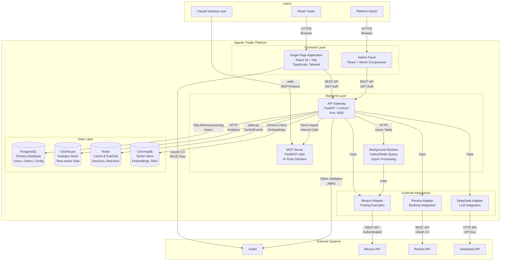

# C4 Architecture - Level 2: Container Diagram

> Container-level view showing applications, databases, and their interactions

---

## Overview

The Agentic Trader Platform consists of multiple containers working together to provide trading services. Each container is a separately deployable/runnable unit.

---

## Container Diagram



---

## Container Details

### Frontend Layer

| Container | Technology | Purpose | Scaling |
|-----------|------------|---------|---------|
| Single Page Application | React 19, Vite 7, TypeScript 5.9 | User trading dashboard | CDN distributed |
| Admin Panel | React, Tailwind, shadcn/ui | Platform administration | CDN distributed |

**Key Characteristics:**
- Static files served via nginx
- Client-side routing (React Router)
- In-memory state management (Zustand)
- WebSocket client for real-time updates

### Backend Layer

| Container | Technology | Purpose | Scaling |
|-----------|------------|---------|---------|
| API Gateway | FastAPI, Uvicorn, Python 3.13 | REST API, WebSocket, Auth | Horizontal (stateless) |
| MCP Server | FastMCP, Python 3.13 | AI tools interface | Per-instance (stdio) |
| Background Workers | Celery, Redis Queue | Async processing, reports | Horizontal (queue-based) |

**Key Characteristics:**
- Stateless API servers behind load balancer
- MCP Server runs as subprocess (stdio transport)
- Workers consume from Redis queues
- Async/await throughout (asyncio)

### Data Layer

| Container | Technology | Purpose | Persistence |
|-----------|------------|---------|-------------|
| PostgreSQL | PostgreSQL 15 + TimescaleDB | Primary OLTP data | Persistent SSD |
| ClickHouse | ClickHouse 24.3 | Analytics, time-series | Persistent SSD |
| Redis | Redis 7.2 | Cache, sessions, pub/sub | AOF + RDB |
| ChromaDB | ChromaDB 0.5 | Vector embeddings | Persistent volume |

**Key Characteristics:**
- PostgreSQL: ACID transactions, row-level security
- ClickHouse: Columnar storage, fast aggregations
- Redis: Sub-millisecond latency, TTL support
- ChromaDB: Similarity search, RAG support

### External Integrations

| Container | Purpose | Protocol | Auth Method |
|-----------|---------|----------|-------------|
| Bitvavo Adapter | Crypto trading | REST + WebSocket | API Key + IP Whitelist |
| Revolut Adapter | Banking/fiat | REST API | OAuth 2.0 |
| DeepSeek Adapter | AI/LLM inference | HTTP API | API Key |

---

## Technology Stack Summary

```
┌─────────────────────────────────────────────────────────────────┐
│                         FRONTEND                                 │
│  React 19 + Vite 7 + TypeScript 5.9 + Tailwind CSS + Radix UI   │
├─────────────────────────────────────────────────────────────────┤
│                         BACKEND                                  │
│  FastAPI + Python 3.13 + FastMCP + SQLAlchemy + asyncpg         │
├─────────────────────────────────────────────────────────────────┤
│                         DATA                                     │
│  PostgreSQL + TimescaleDB │ ClickHouse │ Redis │ ChromaDB       │
├─────────────────────────────────────────────────────────────────┤
│                         EXTERNAL                                 │
│  Auth0 │ Bitvavo │ Revolut │ DeepSeek                           │
└─────────────────────────────────────────────────────────────────┘
```

---

## Deployment Topology

### Docker Compose (Development)
```
┌────────────────────────────────────────┐
│           Docker Network               │
│  ┌─────────┐  ┌─────────┐  ┌────────┐ │
│  │   Web   │  │   API   │  │  MCP   │ │
│  │  (80)   │  │ (8000)  │  │ (stdio)│ │
│  └────┬────┘  └────┬────┘  └────────┘ │
│       │            │                  │
│  ┌────┴────────────┴──────────────┐   │
│  │  PostgreSQL │ Redis │ ChromaDB  │   │
│  └─────────────────────────────────┘   │
└────────────────────────────────────────┘
```

### Kubernetes (Production)
```
┌──────────────────────────────────────────┐
│              Kubernetes Cluster          │
│  ┌──────────────────────────────────┐    │
│  │         Ingress Controller         │    │
│  │    (SSL termination, routing)      │    │
│  └──────────────┬───────────────────┘    │
│                 │                        │
│  ┌──────────────┼───────────────────┐    │
│  │              │                   │    │
│  ▼              ▼                   ▼    │
│ ┌──────┐    ┌──────┐            ┌──────┐│
│ │ Web  │    │ API  │───────────▶│ MCP  ││
│ │ Pods │    │ Pods │  (sidecar) │ Pods ││
│ │(3x)  │    │(5x)  │            │(3x)  ││
│ └──┬───┘    └──┬───┘            └──────┘│
│    │           │                        │
│    └───────────┼────────────────────┐   │
│                ▼                    │   │
│  ┌─────────────────────────────┐   │   │
│  │ PostgreSQL │ Redis │ClickHouse│   │   │
│  │   (HA)     │ (HA)  │  (HA)   │   │   │
│  └─────────────────────────────┘   │   │
│                                    │   │
│  ┌─────────────────────────────────┘   │
│  │         Background Workers           │
│  │          (Celery + Redis Queue)      │
│  └──────────────────────────────────────┘
```

---

## Communication Patterns

| From | To | Protocol | Purpose |
|------|-----|----------|---------|
| Browser | WebApp | HTTPS | Load static assets |
| WebApp | API Gateway | HTTPS + JWT | REST API calls |
| WebApp | API Gateway | WSS | Real-time WebSocket |
| Claude Desktop | MCP Server | stdio | AI tool calls |
| API Gateway | PostgreSQL | TCP | SQL queries |
| API Gateway | Redis | TCP | Cache + Pub/Sub |
| API Gateway | ClickHouse | HTTP | Analytics queries |
| API Gateway | ChromaDB | HTTP | Vector search |

---

## Related Documentation

- [Level 1: Context](./01_CONTEXT.md)
- [Level 3: Component](./03_COMPONENT.md)
- [Architecture Decision Records](../../adr/)
- [Deployment Guide](../../deployment/)
