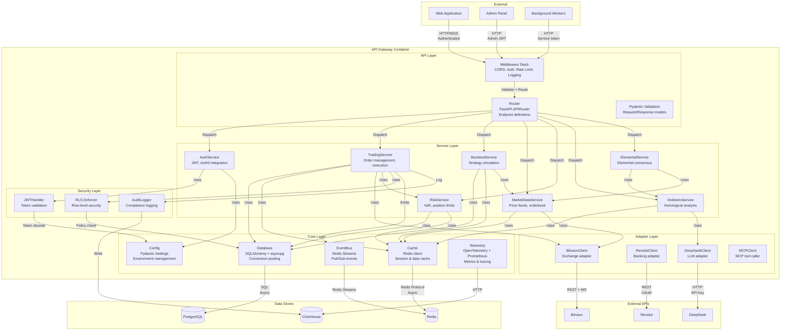
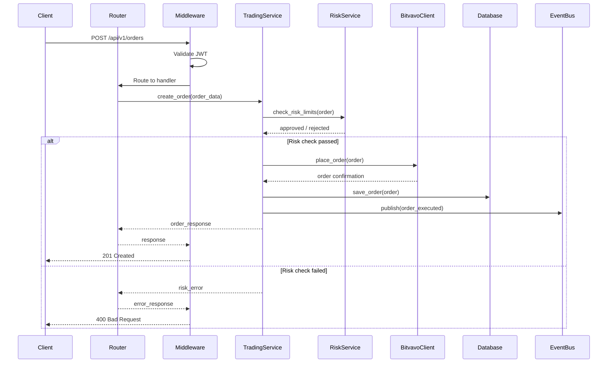
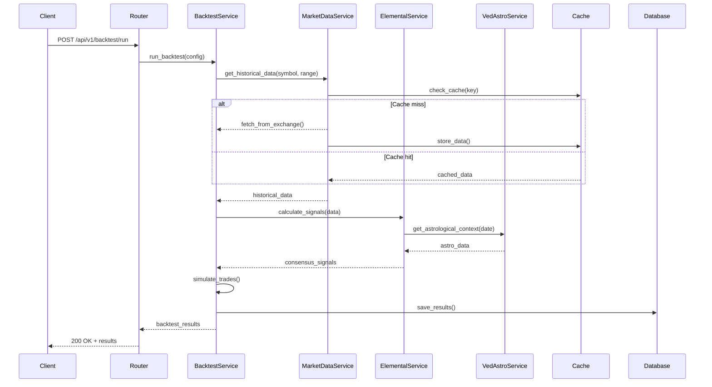
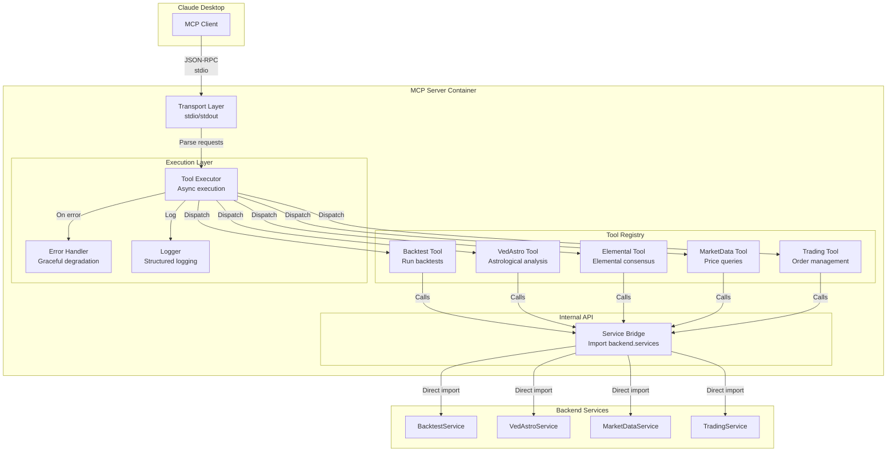

# C4 Architecture - Level 3: Component Diagram

> Component-level view showing internal structure of key containers

---

## Overview

This diagram drills into the Backend API Gateway container, showing its internal components and their responsibilities.

---

## API Gateway Component Diagram



---

## Component Responsibilities

### API Layer

| Component | Responsibility | Key Technologies |
|-----------|----------------|------------------|
| Router | Route HTTP requests to appropriate handlers | FastAPI APIRouter |
| Middleware | Cross-cutting concerns (auth, CORS, rate limiting) | FastAPI Middleware |
| Validator | Request validation, serialization | Pydantic v2 |

### Service Layer

| Component | Responsibility | Dependencies |
|-----------|----------------|--------------|
| AuthService | User authentication, token management | JWTHandler, Config |
| TradingService | Order lifecycle management, execution | BitvavoClient, RiskService, RLS |
| BacktestService | Historical simulation, strategy testing | MarketDataService, Database |
| MarketDataService | Real-time price feeds, orderbook | BitvavoClient, Cache |
| RiskService | Risk calculations, limits enforcement | Database, Cache |
| VedAstroService | Astrological analysis, timing | DeepSeekClient, Cache |
| ElementalService | Multi-factor consensus scoring | VedAstroService, MarketDataService |

### Core Layer

| Component | Responsibility | Key Technologies |
|-----------|----------------|------------------|
| Config | Environment variables, settings | Pydantic Settings |
| Database | Database connections, ORM | SQLAlchemy 2.0, asyncpg |
| Cache | Caching layer, session store | redis-py |
| EventBus | Event streaming, pub/sub | Redis Streams |
| Logger | Observability, metrics | OpenTelemetry, Prometheus |

### Adapter Layer

| Component | Responsibility | Protocol |
|-----------|----------------|----------|
| BitvavoClient | Exchange integration | REST + WebSocket |
| RevolutClient | Banking integration | REST API |
| DeepSeekClient | AI/LLM integration | HTTP API |
| MCPClient | MCP tool execution | stdio |

### Security Layer

| Component | Responsibility | Standards |
|-----------|----------------|-----------|
| JWTHandler | Token validation, claims extraction | RS256, JWKS |
| RLS | Row-level security enforcement | PostgreSQL RLS |
| AuditLogger | Compliance audit trails | MiFID II, GDPR |

---

## Component Interactions

### Trade Execution Flow



### Backtest Execution Flow



---

## MCP Server Component Diagram



---

## File Structure Mapping

```
backend/
├── api/
│   ├── routers/              # Router components
│   │   ├── backtest.py
│   │   ├── trading.py
│   │   └── health.py
│   ├── middleware/           # Middleware components
│   │   ├── auth.py
│   │   ├── rate_limit.py
│   │   └── logging.py
│   ├── websocket_endpoints.py
│   └── main.py               # FastAPI app factory
│
├── services/                 # Service layer
│   ├── auth_service.py
│   ├── trading_service.py
│   ├── backtest_service.py
│   ├── market_data_service.py
│   ├── risk_service.py
│   └── consensus/
│       ├── vedastro_service.py
│       └── elemental_service.py
│
├── core/                     # Core layer
│   ├── config/
│   │   └── settings.py       # Config component
│   ├── database/
│   │   └── session.py        # Database component
│   ├── cache/
│   │   └── redis_client.py   # Cache component
│   ├── events/
│   │   └── event_bus.py      # EventBus component
│   └── telemetry/
│       ├── metrics.py        # Logger component
│       └── tracing.py
│
├── adapters/                 # Adapter layer
│   ├── bitvavo_client.py
│   ├── revolut_client.py
│   └── deepseek_client.py
│
├── security/                 # Security layer
│   ├── jwt_handler.py
│   ├── rls.py
│   └── audit.py
│
└── mcp_server/               # MCP Server
    ├── server.py             # Transport layer
    ├── tools/                # Tool registry
    │   ├── backtest_tool.py
    │   ├── vedastro_tool.py
    │   └── ...
    └── bridge.py             # ServiceBridge
```

---

## Related Documentation

- [Level 2: Container](./02_CONTAINER.md)
- [Level 4: Code](./04_CODE.md)
- [Architecture Decision Records](../../adr/)
- [API Documentation](../../api/)
