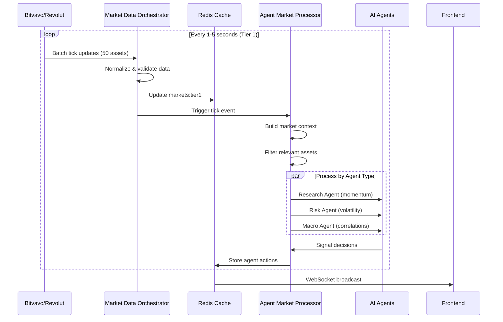

# Agentic Trader: Complete Asset System Implementation Strategy

## Executive Summary

Dit document presenteert een uitgebreide strategie voor het integreren van 448+ assets in het Agentic Trader platform. Het systeem zal real-time marktdata verwerken via een tiered architecture, waarbij AI agents per tick kunnen reageren op echte marktbewegingen.

---

## 1. Huidige Staat Analyse

### Bestaande Componenten
```
┌─────────────────────────────────────────────────────────────┐
│              HUIDIGE MARKET DATA ARCHITECTuur               │
├─────────────────────────────────────────────────────────────┤
│                                                             │
│  ┌──────────────┐    ┌──────────────┐    ┌──────────────┐  │
│  │   Revolut    │    │   Bitvavo    │    │   Kraken     │  │
│  │   (10 pairs) │    │   (API key)  │    │  (Fallback)  │  │
│  └──────┬───────┘    └──────┬───────┘    └──────┬───────┘  │
│         │                   │                   │          │
│         └───────────────────┼───────────────────┘          │
│                             │                              │
│                    ┌────────▼────────┐                     │
│                    │  MarketDataSync │                     │
│                    │  (10 symbols)   │                     │
│                    └────────┬────────┘                     │
│                             │                              │
│                    ┌────────▼────────┐                     │
│                    │  Redis Cache    │                     │
│                    │  (markets:all)  │                     │
│                    └────────┬────────┘                     │
│                             │                              │
│                    ┌────────▼────────┐                     │
│                    │   Frontend      │                     │
│                    │   (Dashboard)   │                     │
│                    └─────────────────┘                     │
│                                                             │
└─────────────────────────────────────────────────────────────┘
```

### Beperkingen
- **Slechts 10 assets** actief gemonitord
- **Geen asset registry** voor alle 448 Bitvavo pairs
- **Geen categorisering** (meme coins, DeFi, Layer 1, etc.)
- **Beperkte agent context** - agents zien niet het volledige marktbeeld

---

## 2. Doelarchitectuur

### 2.1 Backend: Tiered Real-Time Pipeline

```
┌──────────────────────────────────────────────────────────────────────────────┐
│                     ASSET DATA ARCHITECTUUR V2.0                              │
├──────────────────────────────────────────────────────────────────────────────┤
│                                                                               │
│  ┌─────────────────────────────────────────────────────────────────────────┐ │
│  │                        ASSET REGISTRY (PostgreSQL)                       │ │
│  │  ┌──────────────┐  ┌──────────────┐  ┌──────────────┐  ┌─────────────┐ │ │
│  │  │  All Assets  │  │  Categories  │  │   Metadata   │  │   Agents    │ │ │
│  │  │  (448+)      │  │  (12 types)  │  │  (metrics)   │  │ (watched)   │ │ │
│  │  └──────────────┘  └──────────────┘  └──────────────┘  └─────────────┘ │ │
│  └─────────────────────────────────────────────────────────────────────────┘ │
│                                    │                                          │
│                                    ▼                                          │
│  ┌─────────────────────────────────────────────────────────────────────────┐ │
│  │                    MARKET DATA ORCHESTRATOR                              │ │
│  │  ┌──────────────────────────────────────────────────────────────────┐  │ │
│  │  │                    TIER 1: WATCHLIST (Hot Assets)                 │  │ │
│  │  │  ┌────────────┐ ┌────────────┐ ┌────────────┐ ┌────────────┐    │  │ │
│  │  │  │  BTC-EUR   │ │  ETH-EUR   │ │  SOL-EUR   │ │  +47 more  │    │  │ │
│  │  │  │  (100ms)   │ │  (100ms)   │ │  (100ms)   │ │  (100ms)   │    │  │ │
│  │  │  └────────────┘ └────────────┘ └────────────┘ └────────────┘    │  │ │
│  │  │                    Update interval: 1-5 seconds                   │  │ │
│  │  └──────────────────────────────────────────────────────────────────┘  │ │
│  │                                                                         │ │
│  │  ┌──────────────────────────────────────────────────────────────────┐  │ │
│  │  │                    TIER 2: ACTIVE POOL                            │  │ │
│  │  │  ┌─────────────────────────────────────────────────────────────┐ │  │ │
│  │  │  │  150 assets | Update interval: 10-30 seconds               │ │  │ │
│  │  │  │  - High volume pairs                                       │ │  │ │
│  │  │  │  - Assets in agent portfolios                              │ │  │ │
│  │  │  │  - Trending/momentum assets                                │ │  │ │
│  │  │  └─────────────────────────────────────────────────────────────┘ │  │ │
│  │  └──────────────────────────────────────────────────────────────────┘  │ │
│  │                                                                         │ │
│  │  ┌──────────────────────────────────────────────────────────────────┐  │ │
│  │  │                    TIER 3: FULL UNIVERSE                          │  │ │
│  │  │  ┌─────────────────────────────────────────────────────────────┐ │  │ │
│  │  │  │  448+ assets | Update interval: 60-300 seconds             │ │  │ │
│  │  │  │  - All Bitvavo pairs                                       │ │  │ │
│  │  │  │  - Batch updated                                           │ │  │ │
│  │  │  │  - Background sync                                         │ │  │ │
│  │  │  └─────────────────────────────────────────────────────────────┘ │  │ │
│  │  └──────────────────────────────────────────────────────────────────┘  │ │
│  └─────────────────────────────────────────────────────────────────────────┘ │
│                                    │                                          │
│                                    ▼                                          │
│  ┌─────────────────────────────────────────────────────────────────────────┐ │
│  │                      REDIS DATA LAYER                                    │ │
│  │  ┌────────────────┐  ┌────────────────┐  ┌────────────────┐            │ │
│  │  │  markets:tier1 │  │  markets:tier2 │  │  markets:tier3 │            │ │
│  │  │  (hot path)    │  │  (warm cache)  │  │  (cold cache)  │            │ │
│  │  │  TTL: 5s       │  │  TTL: 60s      │  │  TTL: 300s     │            │ │
│  │  └────────────────┘  └────────────────┘  └────────────────┘            │ │
│  │                                                                         │ │
│  │  ┌────────────────┐  ┌────────────────┐  ┌────────────────┐            │ │
│  │  │  assets:all    │  │  assets:by_cat │  │  assets:agents │            │ │
│  │  │  (registry)    │  │  (categories)  │  │  (watched)     │            │ │
│  │  │  TTL: 3600s    │  │  TTL: 3600s    │  │  TTL: 60s      │            │ │
│  │  └────────────────┘  └────────────────┘  └────────────────┘            │ │
│  └─────────────────────────────────────────────────────────────────────────┘ │
│                                    │                                          │
│                                    ▼                                          │
│  ┌─────────────────────────────────────────────────────────────────────────┐ │
│  │                    AGENT MARKET DATA PROCESSOR                           │ │
│  │  ┌──────────────────────────────────────────────────────────────────┐  │ │
│  │  │  Per Tick Event Flow:                                             │  │ │
│  │  │                                                                   │  │ │
│  │  │  1. Price Update Received ──► 2. Context Builder                 │  │ │
│  │  │                                      │                           │  │ │
│  │  │  3. Agent Relevance Filter ◄───┘   4. Market Context             │  │ │
│  │  │         │                               │   (market snapshot)      │  │ │
│  │  │         ▼                               ▼                        │  │ │
│  │  │  ┌──────────────┐  ┌──────────────┐  ┌──────────────┐          │  │ │
│  │  │  │  Research    │  │  RiskGuard   │  │  Valuation   │          │  │ │
│  │  │  │  Agent       │  │  Agent       │  │  Agent       │          │  │ │
│  │  │  └──────────────┘  └──────────────┘  └──────────────┘          │  │ │
│  │  │         │               │               │                       │  │ │
│  │  │         └───────────────┼───────────────┘                       │  │ │
│  │  │                         ▼                                       │  │ │
│  │  │                  ┌──────────────┐                              │  │ │
│  │  │                  │  Decision    │                              │  │ │
│  │  │                  │  Engine      │                              │  │ │
│  │  │                  └──────────────┘                              │  │ │
│  │  └──────────────────────────────────────────────────────────────────┘  │ │
│  └─────────────────────────────────────────────────────────────────────────┘ │
│                                                                               │
└──────────────────────────────────────────────────────────────────────────────┘
```

### 2.2 Frontend: Categorized Asset Selector

```
┌──────────────────────────────────────────────────────────────────────────────┐
│                     FRONTEND ASSET ARCHITECTUUR                               │
├──────────────────────────────────────────────────────────────────────────────┤
│                                                                               │
│  ┌─────────────────────────────────────────────────────────────────────────┐ │
│  │                    ASSET STORE (Zustand)                                 │ │
│  │  ┌────────────────┐  ┌────────────────┐  ┌────────────────┐            │ │
│  │  │  allAssets     │  │  categories    │  │  watchlist     │            │ │
│  │  │  (448+)        │  │  (12 groups)   │  │  (user prefs)  │            │ │
│  │  └────────────────┘  └────────────────┘  └────────────────┘            │ │
│  └─────────────────────────────────────────────────────────────────────────┘ │
│                                    │                                          │
│                                    ▼                                          │
│  ┌─────────────────────────────────────────────────────────────────────────┐ │
│  │                    ASSET SELECTOR COMPONENT                              │ │
│  │                                                                         │ │
│  │  ┌─────────────────────────────────────────────────────────────────┐   │ │
│  │  │  Search Bar [🔍 Search 448 assets...]                           │   │ │
│  │  └─────────────────────────────────────────────────────────────────┘   │ │
│  │                                                                         │ │
│  │  ┌─────────────────┐  ┌─────────────────┐  ┌─────────────────┐        │ │
│  │  │  [Layer 1 ▼]    │  │  [DeFi ▼]       │  │  [Meme ▼]       │        │ │
│  │  │  ┌───────────┐  │  │  ┌───────────┐  │  │  ┌───────────┐  │        │ │
│  │  │  │ BTC       │  │  │  │ UNI       │  │  │  │ DOGE      │  │        │ │
│  │  │  │ ETH       │  │  │  │ AAVE      │  │  │  │ SHIB      │  │        │ │
│  │  │  │ SOL       │  │  │  │ MKR       │  │  │  │ PEPE      │  │        │ │
│  │  │  │ ADA       │  │  │  │ COMP      │  │  │  │ ...       │  │        │ │
│  │  │  └───────────┘  │  │  └───────────┘  │  │  └───────────┘  │        │ │
│  │  │  Scrollable     │  │  Scrollable     │  │  Scrollable     │        │ │
│  │  │  (max 50 items) │  │  (max 50 items) │  │  (max 50 items) │        │ │
│  │  └─────────────────┘  └─────────────────┘  └─────────────────┘        │ │
│  │                                                                         │ │
│  │  ┌─────────────────┐  ┌─────────────────┐  ┌─────────────────┐        │ │
│  │  │  [Gaming ▼]     │  │  [AI ▼]         │  │  [RWA ▼]        │        │ │
│  │  │  ┌───────────┐  │  │  ┌───────────┐  │  │  ┌───────────┐  │        │ │
│  │  │  │ SAND      │  │  │  │ FET       │  │  │  │ ONDO      │  │        │ │
│  │  │  │ MANA      │  │  │  │ RNDR      │  │  │  │ CFG       │  │        │ │
│  │  │  │ AXS       │  │  │  │ AGIX      │  │  │  │ ...       │  │        │ │
│  │  │  └───────────┘  │  │  └───────────┘  │  │  └───────────┘  │        │ │
│  │  └─────────────────┘  └─────────────────┘  └─────────────────┘        │ │
│  │                                                                         │ │
│  └─────────────────────────────────────────────────────────────────────────┘ │
│                                    │                                          │
│                                    ▼                                          │
│  ┌─────────────────────────────────────────────────────────────────────────┐ │
│  │                    CHART COMPONENT                                       │ │
│  │  ┌─────────────────────────────────────────────────────────────────┐   │ │
│  │  │  [BTC-EUR ▼]  [Price: €54,230]  [+2.4% ▲]                      │   │ │
│  │  │                                                                 │   │ │
│  │  │  ┌─────────────────────────────────────────────────────────┐   │   │ │
│  │  │  │                   CANDLESTICK CHART                    │   │   │ │
│  │  │  │                                                         │   │   │ │
│  │  │  └─────────────────────────────────────────────────────────┘   │   │ │
│  │  └─────────────────────────────────────────────────────────────────┘   │ │
│  └─────────────────────────────────────────────────────────────────────────┘ │
│                                                                               │
└──────────────────────────────────────────────────────────────────────────────┘
```

---

## 3. Data Flow Architecture

### 3.1 Real-Time Tick Processing



### 3.2 Agent Context Building

```python
# Concept: Market Context per Tick
{
    "timestamp": "2025-01-18T18:45:00Z",
    "tier": 1,
    "market_snapshot": {
        "btc": {"price": 54230, "change_24h": 2.4, "volume": 1.2e9},
        "eth": {"price": 2850, "change_24h": 1.8, "volume": 8.5e8},
        # ... 48 more assets
    },
    "categories": {
        "layer1": {"avg_change": 2.1, "leader": "SOL"},
        "defi": {"avg_change": -0.5, "leader": "UNI"},
        "meme": {"avg_change": 5.2, "leader": "DOGE"},
    },
    "correlations": {
        "btc_eth": 0.87,
        "btc_sol": 0.72,
    },
    "agent_relevance": {
        "research_v1": ["BTC", "ETH", "SOL"],  # High momentum
        "risk_v1": ["DOGE", "SHIB"],           # High volatility
        "macro_v1": ["BTC", "ETH"],            # Market leaders
    }
}
```

---

## 4. Component Specificatie

### 4.1 Asset Registry Service

**Doel:** Centrale bron van waarheid voor alle 448+ assets

**Database Schema:**
```sql
-- assets table
CREATE TABLE assets (
    id SERIAL PRIMARY KEY,
    symbol VARCHAR(20) UNIQUE NOT NULL,        -- BTC-EUR
    base_asset VARCHAR(10) NOT NULL,           -- BTC
    quote_asset VARCHAR(10) NOT NULL,          -- EUR
    name VARCHAR(100) NOT NULL,                -- Bitcoin

    -- Categorization
    category VARCHAR(50),                      -- layer1, defi, meme, gaming, ai, rwa
    subcategory VARCHAR(50),                   -- payment, smart_contract, dex, etc
    tags TEXT[],                               -- ['proof-of-work', 'store-of-value']

    -- Market Data
    exchange VARCHAR(50) NOT NULL,             -- bitvavo, revolut
    is_active BOOLEAN DEFAULT true,
    tier INTEGER DEFAULT 3,                    -- 1, 2, 3

    -- Metadata
    market_cap_rank INTEGER,
    volume_24h_rank INTEGER,
    listing_date TIMESTAMP,

    -- Timestamps
    created_at TIMESTAMP DEFAULT NOW(),
    updated_at TIMESTAMP DEFAULT NOW()
);

-- asset_categories table
CREATE TABLE asset_categories (
    id SERIAL PRIMARY KEY,
    name VARCHAR(50) UNIQUE NOT NULL,
    display_name VARCHAR(100),
    description TEXT,
    icon_url VARCHAR(255),
    sort_order INTEGER DEFAULT 0
);

-- agent_asset_watchlist table
CREATE TABLE agent_asset_watchlist (
    id SERIAL PRIMARY KEY,
    agent_id VARCHAR(50) NOT NULL,
    asset_symbol VARCHAR(20) NOT NULL,
    priority INTEGER DEFAULT 1,                -- 1-10
    added_at TIMESTAMP DEFAULT NOW(),
    FOREIGN KEY (asset_symbol) REFERENCES assets(symbol)
);
```

**API Endpoints:**
```python
@router.get("/assets")
async def get_assets(
    category: Optional[str] = None,
    tier: Optional[int] = None,
    search: Optional[str] = None,
    limit: int = 50,
    offset: int = 0
) -> List[AssetResponse]:
    ...

@router.get("/assets/categories")
async def get_asset_categories() -> List[CategoryResponse]:
    ...

@router.post("/assets/{symbol}/watch")
async def watch_asset(symbol: str, agent_id: str):
    ...
```

### 4.2 Tiered Market Data Service

**Configuratie:**
```python
# config/market_data.yaml
market_data_tiers:
  tier1:
    count: 50
    update_interval: 1        # seconds
    criteria:
      - top_volume_24h
      - agent_watchlist
      - user_watchlist

  tier2:
    count: 150
    update_interval: 10       # seconds
    criteria:
      - high_volume
      - trending
      - portfolio_holdings

  tier3:
    count: 448
    update_interval: 60       # seconds
    criteria:
      - all_active_assets
      - background_sync
```

**Implementatie:**
```python
class TieredMarketDataService:
    def __init__(self):
        self.tier1 = Tier1Manager(interval=1)
        self.tier2 = Tier2Manager(interval=10)
        self.tier3 = Tier3Manager(interval=60)

    async def start(self):
        await asyncio.gather(
            self.tier1.start(),
            self.tier2.start(),
            self.tier3.start(),
        )

    async def promote_asset(self, symbol: str, to_tier: int):
        """Move asset to higher tier based on activity"""
        ...
```

### 4.3 Agent Market Context Builder

**Doel:** Per tick een gepersonaliseerde context bouwen voor elke agent

**Flow:**
```python
class AgentContextBuilder:
    def build_context(self, tick_data: TickData, agent_id: str) -> AgentContext:
        # 1. Get agent's watched assets
        watched_assets = self.get_agent_watchlist(agent_id)

        # 2. Get relevant market data
        market_data = self.cache.get_multi([f"asset:{s}" for s in watched_assets])

        # 3. Calculate category performance
        categories = self.calculate_category_metrics(market_data)

        # 4. Find correlations
        correlations = self.calculate_correlations(market_data)

        # 5. Build final context
        return AgentContext(
            timestamp=tick_data.timestamp,
            assets=market_data,
            categories=categories,
            correlations=correlations,
            signals=self.detect_signals(market_data),
        )
```

### 4.4 Frontend Asset Store

**Zustand Store:**
```typescript
interface AssetStore {
  // All assets
  allAssets: Asset[];
  totalAssets: number;

  // Categorized
  categories: AssetCategory[];
  assetsByCategory: Record<string, Asset[]>;

  // User preferences
  watchlist: string[];
  recentlyViewed: string[];

  // UI State
  selectedAsset: string | null;
  searchQuery: string;
  activeCategory: string | null;

  // Actions
  fetchAssets: (params?: AssetFilter) => Promise<void>;
  fetchCategories: () => Promise<void>;
  addToWatchlist: (symbol: string) => void;
  removeFromWatchlist: (symbol: string) => void;
  selectAsset: (symbol: string) => void;
  searchAssets: (query: string) => Asset[];
}
```

---

## 5. Implementatie Roadmap

### Fase 1: Foundation (Week 1)
- [ ] Asset Registry database setup
- [ ] Import 448 Bitvavo assets
- [ ] Categorize assets (layer1, defi, meme, etc.)
- [ ] API endpoints voor asset listing

### Fase 2: Backend Pipeline (Week 2)
- [ ] Tiered Market Data Service
- [ ] Redis cache structuur
- [ ] Asset promotion/demotion logic
- [ ] WebSocket broadcast

### Fase 3: Agent Integration (Week 3)
- [ ] Agent Context Builder
- [ ] Per-agent watchlists
- [ ] Tick processing pipeline
- [ ] Signal detection

### Fase 4: Frontend (Week 4)
- [ ] Asset Store (Zustand)
- [ ] Categorized Asset Selector
- [ ] Search & filter
- [ ] Chart integration

### Fase 5: Optimization (Week 5)
- [ ] Performance testing
- [ ] Cache optimization
- [ ] Agent behavior tuning
- [ ] Load balancing

---

## 6. Technische Overwegingen

### 6.1 Performance Targets

| Metric | Target | Huidig |
|--------|--------|--------|
| Tier 1 update latency | < 2s | 10s |
| Tier 2 update latency | < 15s | N/A |
| Tier 3 update latency | < 120s | N/A |
| Agent tick processing | < 100ms | N/A |
| Frontend asset load | < 500ms | N/A |
| WebSocket latency | < 50ms | N/A |

### 6.2 Resource Usage

| Component | CPU | Memory | Network |
|-----------|-----|--------|---------|
| Asset Registry | Low | 100MB | Low |
| Tier 1 Sync | Medium | 50MB | High |
| Tier 2 Sync | Low | 100MB | Medium |
| Tier 3 Sync | Low | 200MB | Low |
| Agent Processor | High | 300MB | Medium |

### 6.3 Schaalbaarheid

- **Horizontal:** Meerdere market data instances per tier
- **Vertical:** Agent processing parallelisatie
- **Caching:** Multi-level Redis cache
- **Database:** Read replicas voor asset queries

---

## 7. Risico's & Mitigatie

| Risico | Impact | Mitigatie |
|--------|--------|-----------|
| Rate limiting exchanges | High | Exponential backoff, tiered fetching |
| Memory overflow | Medium | LRU cache, asset eviction |
| Agent overload | High | Context filtering, relevance scoring |
| Frontend performance | Medium | Virtualization, lazy loading |
| Data inconsistency | High | Event sourcing, idempotent updates |

---

## 8. Succes Criteria

- [ ] Alle 448 Bitvavo assets beschikbaar in backend
- [ ] Real-time updates voor top 50 assets (< 2s latency)
- [ ] Agents kunnen per tick beslissingen nemen op echte data
- [ ] Frontend toont gecategoriseerde asset selector
- [ ] Gebruiker kan elk asset selecteren voor chart
- [ ] Systeem presteert onder 100ms per agent tick
- [ ] Autonome trading op volledige dataset

---

## 9. Vervolgstappen

1. **Go/No-Go beslissing** op deze strategie
2. **Prioriteit bepaling** - welke features eerst?
3. **Resource allocatie** - wie doet wat?
4. **Start implementatie** Fase 1

Wat vind je van deze strategie? Zijn er onderdelen die je wilt aanpassen of uitbreiden?
