# Unified Consciousness Integration - Complete Flow Diagram

## Architecture Overview

```mermaid
flowchart TB
    subgraph ENTRY["📥 ENTRY POINT"]
        MT[Market Tick<br/>symbol + price]
    end

    subgraph PHASE_B["🔮 PHASE B: Consciousness Gates"]
        direction TB
        NG[NavagrahaService<br/>get_current_state]
        TK[Trading Gate Check]
        TG_OPEN{Trading Gate<br/>Open?}
        RAHU{Rahu Kala<br/>Active?}
        TAMAS{Tamas > 60%?}
        GUNA[Guna Distribution<br/>Sattva/Rajas/Tamas]
        CONSC[Consciousness Level<br/>Pure Awareness → Material Density]
        
        NG --> GUNA
        GUNA --> TK
        TK --> RAHU
        RAHU -->|Yes| BLOCK1[BLOCKED_BY_CONSCIOUSNESS_GATE]
        RAHU -->|No| TAMAS
        TAMAS -->|Yes| BLOCK1
        TAMAS -->|No| TG_OPEN
        TG_OPEN -->|Yes| CONT1[Continue to Phase A]
    end

    subgraph PHASE_A["🧠 PHASE A: Orchestration"]
        direction TB
        COG_ORCH[CognitiveOrchestrator<br/>handle_market_tick]
        GUNA_BAL[Guna Balance<br/>current_guna_balance]
        
        CONT1 --> COG_ORCH
        COG_ORCH --> GUNA_BAL
    end

    subgraph OODA_LOOP["🔄 OODA LOOP (Primary Brain)"]
        direction TB
        
        subgraph OBSERVE["1️⃣ OBSERVE"]
            DS[DataScoutAgent<br/>observe]
            OBS[Observation<br/>price/volume/orderbook]
        end
        
        subgraph ORIENT["2️⃣ ORIENT"]
            direction TB
            CB[CognitiveBridge<br/>process_observation]
            AN[AnalystAgent<br/>orient]
            GUNA_MOD[Guna Modulation<br/>confidence -= tamas_penalty]
            BULL[BullResearcher<br/>generate_hypothesis]
            BEAR[BearResearcher<br/>generate_hypothesis]
            ORIENT_OBJ[Orientation<br/>regime/indicators/confidence]
            
            CB --> AN
            GUNA_BAL --> GUNA_MOD
            AN --> GUNA_MOD
            GUNA_MOD --> ORIENT_OBJ
            ORIENT_OBJ --> BULL
            ORIENT_OBJ --> BEAR
        end
        
        subgraph DECIDE["3️⃣ DECIDE"]
            direction TB
            TATTVA_CHECK[SystemIdentity<br/>Kanchuka Risk Gate]
            TRADER[TraderAgent<br/>propose_trade]
            STRAT_REG[UnifiedStrategyRegistry<br/>Dasha-based Strategy]
            PROP[TradeProposal<br/>side/size/entry/stop/take_profit]
            RISK_ORCH{RiskOrchestrator<br/>pre_trade_check}
            RISK_MGR[RiskManagerAgent<br/>assess_risk]
            RISK_RES{RiskAssessment<br/>APPROVE/REJECT/MODIFY}
            
            ORIENT_OBJ --> TATTVA_CHECK
            TATTVA_CHECK --> TRADER
            TRADER --> STRAT_REG
            STRAT_REG --> PROP
            PROP --> RISK_ORCH
            RISK_ORCH -->|Blocked| RISK_RES
            RISK_ORCH -->|Approved| RISK_MGR
            RISK_MGR --> RISK_RES
        end
        
        subgraph HARMONIZE["4️⃣ HARMONIZE"]
            ORCH[OrchestratorAgent<br/>harmonize]
            HARM{Harmony Check<br/>Pass?}
            
            RISK_RES -->|APPROVE| ORCH
            ORCH --> HARM
        end
        
        subgraph ACT["5️⃣ ACT"]
            FM[FundManager<br/>allocate_capital]
            ALLOC[CapitalAllocation<br/>approved/position_size]
            EXEC{Trading Mode<br/>AUTO?}
            OE[OrderExecutor<br/>execute_trade]
            EX_RES[ExecutionResult<br/>filled_qty/avg_price]
            
            HARM -->|Pass| FM
            FM --> ALLOC
            ALLOC --> EXEC
            EXEC -->|Yes| OE
            EXEC -->|No| NOTIFY[Notify Only]
            OE --> EX_RES
        end
    end

    subgraph PHASE_E["📚 PHASE E: Learning Loop"]
        direction TB
        KARMA[KarmaRegister<br/>register_feedback]
        SYS_ID[SystemIdentity<br/>update_outcome]
        RL[Reinforcement<br/>parameter tuning]
        
        EX_RES --> KARMA
        KARMA --> SYS_ID
        SYS_ID --> RL
    end

    subgraph EXIT["📤 EXIT POINTS"]
        direction TB
        SUCCESS[✅ Trade Executed<br/>P&L Recorded]
        BLOCKED[❌ Trade Blocked<br/>Reason Logged]
        NOTIFY_END[📧 Notification Sent<br/>Human Approval Required]
        
        EX_RES --> SUCCESS
        BLOCK1 --> BLOCKED
        RISK_RES -->|REJECT| BLOCKED
        HARM -->|Fail| BLOCKED
        NOTIFY --> NOTIFY_END
    end

    %% Main Flow Connections
    MT --> PHASE_B
    PHASE_B --> PHASE_A
    PHASE_A --> OBSERVE
    OBSERVE --> ORIENT
    ORIENT --> DECIDE
    DECIDE --> HARMONIZE
    HARMONIZE --> ACT
    ACT --> PHASE_E
    PHASE_E --> EXIT

    %% Styling
    style ENTRY fill:#e1f5fe
    style PHASE_B fill:#fff3e0
    style PHASE_A fill:#e8f5e9
    style OODA_LOOP fill:#fce4ec
    style PHASE_E fill:#f3e5f5
    style EXIT fill:#ffebee
    
    style BLOCK1 fill:#ff5252,color:#fff
    style BLOCKED fill:#ff5252,color:#fff
    style SUCCESS fill:#69f0ae
    style NOTIFY_END fill:#ffd740
```

## Component Interaction Diagram

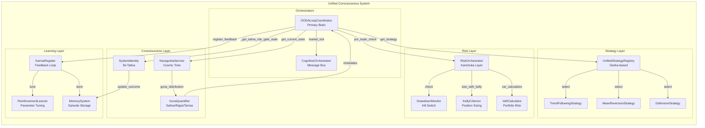

## Decision Tree Flow

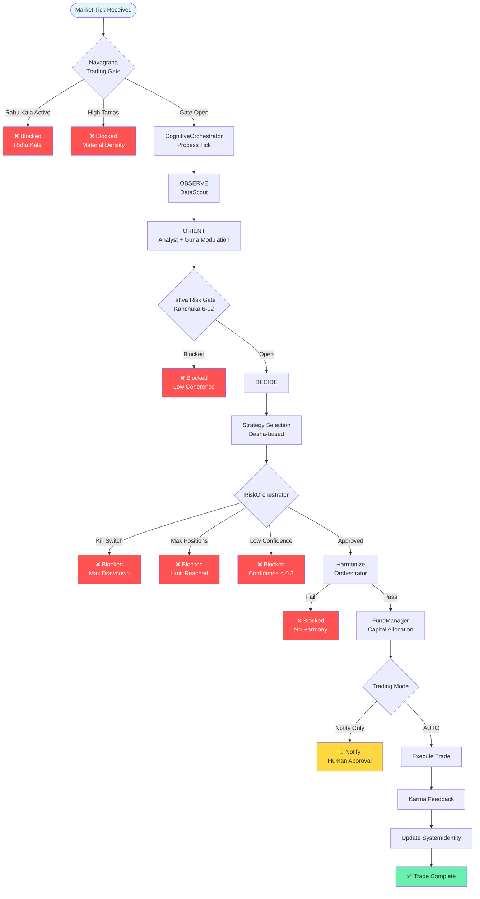

## Data Flow Diagram

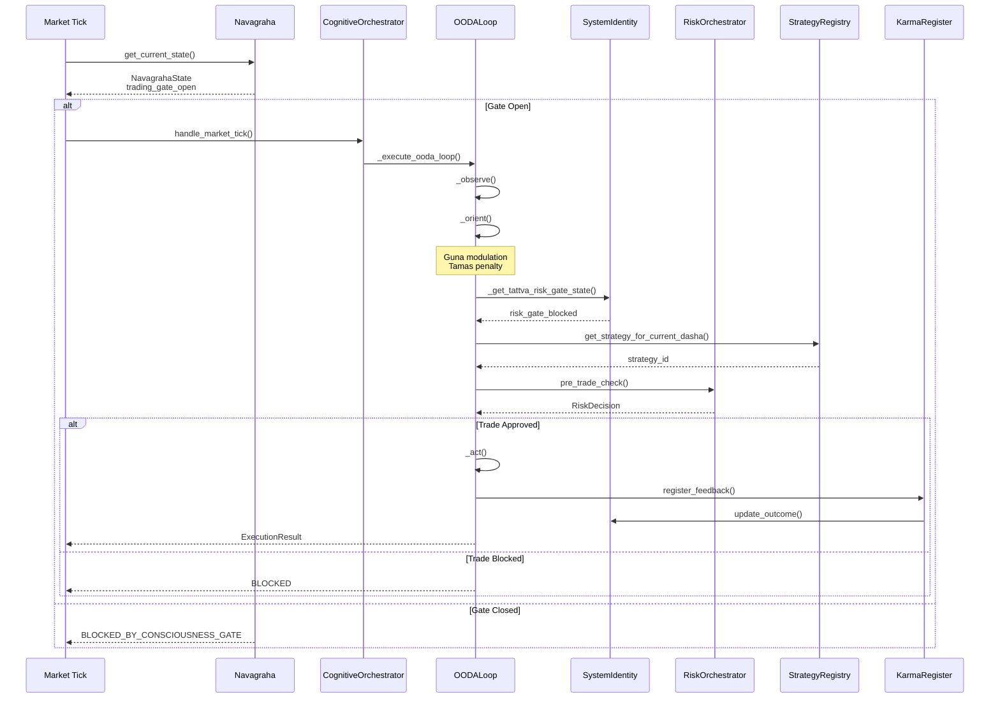

## Component State Diagram

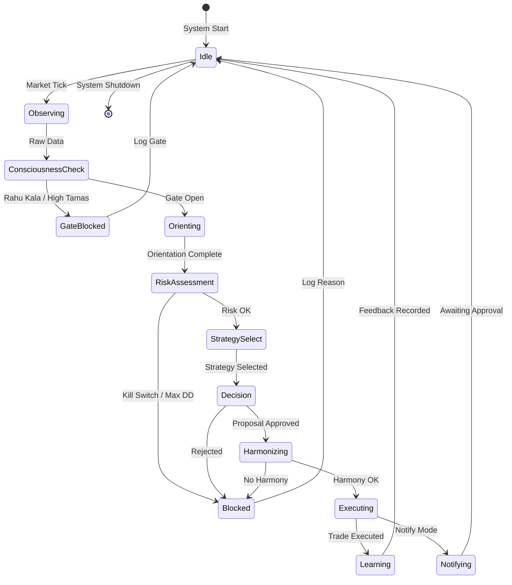

## Phase-by-Phase Breakdown

### Phase A: Unify Orchestration
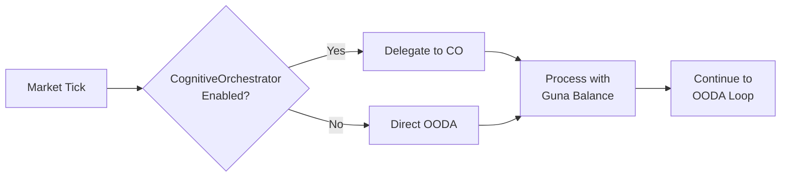

### Phase B: Connect Consciousness
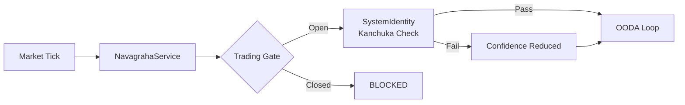

### Phase C: Wire Risk Pipeline
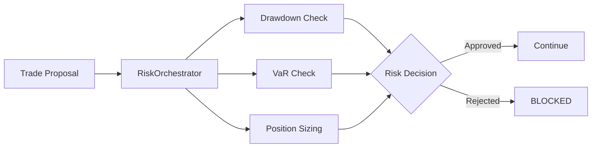

### Phase D: Strategy Integration
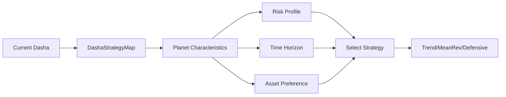

### Phase E: Learning Loop
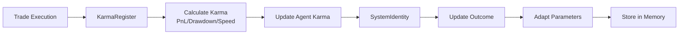

## Key Metrics & Monitoring Points

```mermaid
flowchart TB
    subgraph METRICS["📊 Key Metrics"]
        M1[Cycles Completed]
        M2[Trading Gate Status]
        M3[Guna Distribution]
        M4[Tattva Coherence]
        M5[Risk Score]
        M6[Harmony Score]
        M7[Karma Score]
        M8[Win Rate]
    end
    
    subgraph ALERTS["🚨 Alert Conditions"]
        A1[Rahu Kala Active]
        A2[Kill Switch Triggered]
        A3[Max Drawdown]
        A4[Low Sattva < 25%]
        A5[High Tamas > 60%]
        A6[Kanchuka Blocked]
    end
    
    M1 --> PROM[Prometheus Metrics]
    M2 --> PROM
    M3 --> PROM
    M4 --> PROM
    M5 --> PROM
    M6 --> PROM
    M7 --> PROM
    M8 --> PROM
    
    A1 --> ALERT[Alert Manager]
    A2 --> ALERT
    A3 --> ALERT
    A4 --> ALERT
    A5 --> ALERT
    A6 --> ALERT
```

---

*Last Updated: 2026-02-17*
*Unified Consciousness Flow v1.0*
